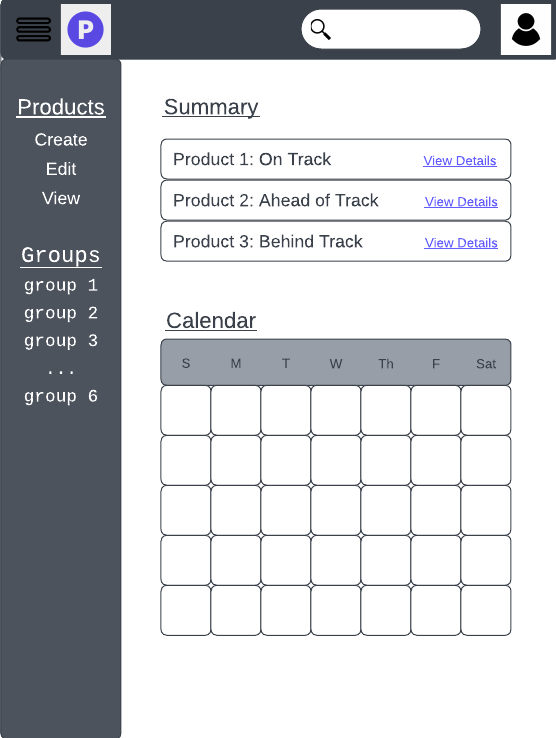

# Startup Specification

### Elevator pitch

Managing consumer goods in production can be difficult, which can lead to all sort of problems with managing if production is efficient enough, time of shipping products, employee efficiency, etc. This product tracking application will allow organizations to digitally create products with information about production such as materials and time of production, and it will gather data on the efficiency of production for better optimization. Employees will scan a code to log the start time of their task and scan it again to log the end time of their task. The time of each task and the stages of a product will be logged to the online web application for viewing and analysis. With this tool, companies will be able to be better organized and take the next step forward with their manufacturing.

### Design

**Note: Design has been changed** 

### Key features

- Secure login over HTTPS
- Ability to create, edit, and view products
- Display of product production
- Ability to specify product details such as materials and processes
- Progress from production displayed in realtime
- Results are production tasks are persistently stored and displayed
- Ability to create and join organizations.
- Ability for admin to create and delete products and invite others.

### Technologies

I am going to use the required technologies in the following ways.

- **HTML** - Uses correct HTML structure for application. Created 4 HTML pages. Pages for login, manager dashboard page, admin group summary, and employee page. 
- **CSS** - Application styling that looks good on different screen sizes, uses good whitespace, color choice and contrast. (Yes, I copied this from the example because it's literally what CSS is used for. What else am I supposed to say? You better not doc me!)
- **JavaScript** - Provides login, choice display, creating/viewing products, and creating/viewing groups.
- **Service** - Backend service with endpoints for:
  - login
  - retrieving product information
  - creating products
  - retrieving group information
  - creating groups
- **DB** - Store users, groups, products, and product information in database.
- **Login** - Register and login users. Credentials securely stored in database. Can't use web application unless authenticated. (Yes, I copied this from the example because it's literally what logins is used for. What else am I supposed to say? You better not doc me!)
- **WebSocket** - As each user updates a task, their product information are broadcast to all other admins in the organization.
- **React** - Application ported to use the React web framework. (Yeah, I don't know what React is used for exactly, so I copied this too. You better not doc me! please.)

---

(I don't know if the deliverable stuff is supposed to be here, but I have it...)

## HTML deliverable

For this deliverable I built out the structure of my application using HTML.

- **HTML pages** - 4 HTML page that are to login, a manager dashboard page, a admin group page, and an employee page.
- **Links** - The login page automatically links to the home page. Each of the pages contains links for every page but will be removed. At the end, the only link should be one from the admin group page to a manager dashboard page.
- **Text** - Each of the products are represented by a textual description.
- **Images** - Display an image of the product (and maybe employee faces).
- **Login** - Input box and submit button for login. Login will determine which page the user will be directed to.
- **Database** - The product and group information are pulled from the database.
- **WebSocket** - The update of product tasks are updated to the web app in realtime. The data will update the `Last Updated` column in the various tables

## CSS deliverable

For this deliverable I properly styled the application into its final appearance.

- **Header, footer, and main content body** - Adding a consistent header and footer across all webpages (index.html, dashboard.html, employee.html). The bodies in each of the webpages have been customized with the most being the dashboard.html page (you can only access it using for link at the bottom for now. The logic to visit that webpage will be implemented later). 
- **Navigation elements** - There isn't and won't be much navigation on my webpage except from the login screen and the user's respective dashboard (employee or manager), but I did include a temporary nav at in the footer and a logout button in each of the dashboards.
- **Responsive to window resizing** - My app looks great on all window sizes and devices. The entire body of the webpage adjusts to the device width, like the tables, navigation bar, and footer. (I even tested it on my own mobile device.)

- **Application elements** - Tried to use good contrast and whitespace. For the most part everything looks good, but there may be too
  much white space in the employee.html page (but don't dock points!). Stuck to only 4 colors (black, white, light gray, dark gray) and kept consistent font styles.  
- **Application text content** - There are consistent fonts since I used bootstrap.
- **Application images** - The only images in my application are when viewing/editing the product information, so I set a 
  a fixed width and height within the appeared modal.

## JavaScript deliverable

For this deliverable I implemented by JavaScript so that the application works for a single user. I also added placeholders for future technology.

- **login** - When you press enter or the login button it takes you to the either the employee page or the manager's dashboard page depending on whether or not you registered as a manager or an employee.
- **database** - Displayed the products progress and information in the tables. Currently this is stored and retrieved from an array in the memory of the program, but it will be replaced with the database data later.
- **WebSocket** - I used the setInterval function to periodically add and complete orders. Because of this, the contents of the summary and upcoming table will change. (If you look at the console, you'll see orders appearing and disappearing from the first array).
- **application logic** - The product, group, and summary display change based up the user's selections and information from the database. For example, if the user changes the time frame given in the top right of each table, the number of products shown changes or if the manager edits or adds a product, that will also show up when looking up that order.

## Service deliverable

For this deliverable I added backend endpoints that receives product and group information and returns a summary.

- **Node.js/Express HTTP service** - done!
- **Static middleware for frontend** - done!
- **Calls to third party endpoints** - Grabbed a quote from a third party end point and incorporated it into the footing of my website (I couldn't think of how else to use a third part endpoint... don't doc me please).
- **Backend service endpoints** - Added login and register end points that will later allow a database to be accessed. The frontend login.js refers to these end points. Additionally, there are CRUD endpoints (except for delete) for managing tasks.
- **Frontend calls service endpoints** - I did this using the fetch function whenever I needed to register/get users and when I needed to add an order, get orders, or update orders. 

## DB deliverable

For this deliverable I stored the product information in the database.

- **MongoDB Atlas database created** - done!
- **Endpoints for data** - Stubbed out endpoints now process the data and send it to Mongo. I access the database through functions in `database.js`.
- **Stores data in MongoDB** - Stores the user and order information in the database. Additionally associates both users and orders to a groupID randomly given.

## Login deliverable

For this deliverable I associate the products and groups with the logged in user.

- **User registration** - Creates a new account in the database with an associated group. Duplicate emails are not allowed.
- **Existing user** - Stores the users and their respective groups in the database.
- **Use MongoDB to store credentials** - Stores both user and their groups/products. Emails, passwords, groupIDs, etc. are stored.
- **Restricts functionality** - You cannot use the web application until you have logged in or registered and received a valid authToken. AuthTokens are deleted when the user logs out. If there is an invalid authToken or group, the web app sends you back to index.html.

## WebSocket deliverable

For this deliverable I used webSocket to update the product information on the frontend in realtime without constantly requesting the 
web server for information. When someone in the group adds an order, it sends that notice to the websocket and the websocket notifies all the connections in the same group to update the product information.

- **Backend listens for WebSocket connection** - done! In peerProxy.js
- **Frontend makes WebSocket connection** - done! In main.js
- **Data sent over WebSocket connection** - done! In peerProxy.js and and main.js
- **WebSocket data displayed** - Product information table gets updated when somebody updates or adds an order.

## React deliverable (yeah I don't know what the idea behind this deliverable stuff is, but I did not do anything!)

For this deliverable I converted the application over to use Vue. I know it is supposed to use React, but the instructor said I could use Vue because I already have extensive experience with React.

- **Bundled and transpiled** - done!
- **Components** - Login, product list, groups are all components.
- **Router** - Routing between login and voting components.
- **Hooks** - Vue uses class properties instead of `UseState` to track changes in products/groups state.

**Note to self: Products should be associated with groups, and people should be associated with group. People join groups, products are stored in groups, people see products of a group.